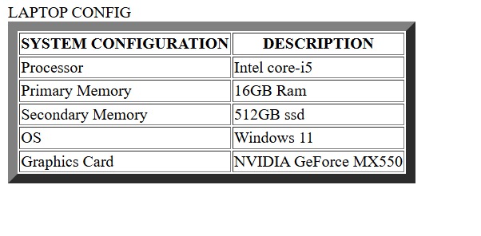

# EX01 Developing a Simple Webserver
## Date:
24/10/2024

## AIM:
To develop a simple webserver to serve html pages and display the configuration details of laptop.

## DESIGN STEPS:
### Step 1: 
HTML content creation.

### Step 2:
Design of webserver workflow.

### Step 3:
Implementation using Python code.

### Step 4:
Serving the HTML pages.

### Step 5:
Testing the webserver.

## PROGRAM:
```
from http.server import HTTPServer,BaseHTTPRequestHandler

content='''
<!DOCTYPE html>
<html>
<head>
    <title>LAPTOP</title>
    </head>
    <body>
        LAPTOP CONFIG
        <TABLE border="10" celpadding="15">
            <tr><th>SYSTEM CONFIGURATION</th> <th>DESCRIPTION</th></tr>
            <tr><td>Processor</td> <td> Intel core-i5</td></tr>
            <tr><td>Primary Memory</td> <td>16GB Ram</td></tr>
            <tr><td>Secondary Memory</td> <td>512GB ssd</td></tr>
            <tr><td>OS</td> <td>Windows 11</td></tr>
            <tr><td>Graphics Card</td> <td>NVIDIA GeForce MX550</td></tr>
        </TABLE>
    </body>
</html>
'''

class MyServer(BaseHTTPRequestHandler):
    def do_GET(self):
        print("Get request received...")
        self.send_response(200) 
        self.send_header("content-type", "text/html")       
        self.end_headers()
        self.wfile.write(content.encode())

print("This is my webserver") 
server_address =('',8000)
httpd = HTTPServer(server_address,MyServer)
httpd.serve_forever()
'''
## OUTPUT:



## RESULT:
The program for implementing simple webserver is executed successfully.
```